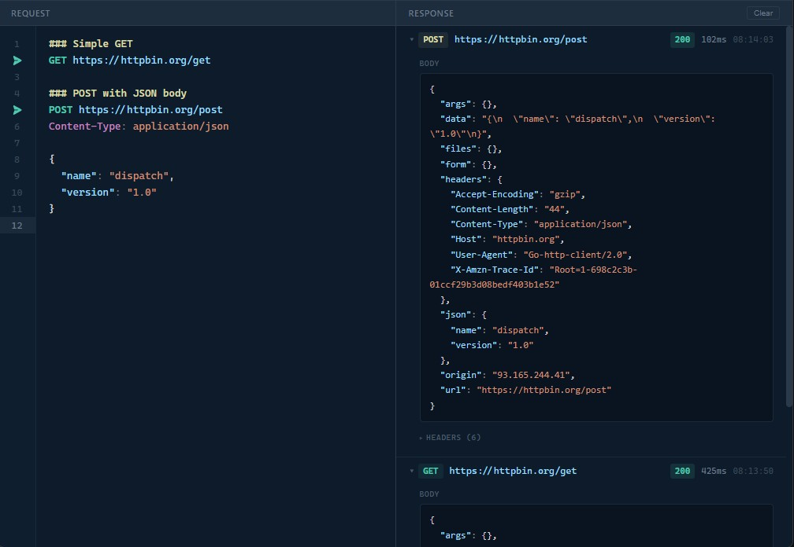

# dispatch

A lightweight desktop HTTP client for crafting and sending requests. Write `.http` file syntax in the built-in editor, hit send, and inspect responses -- all in a single native window.



## Features

- `.http` file syntax with syntax highlighting
- Support for GET, POST, PUT, PATCH, DELETE, HEAD, and OPTIONS methods
- Request headers and JSON body support
- Response viewer with status, headers, body, and timing
- Auto-save to `~/.config/dispatch/requests.http` (or equivalent config dir)
- Send with `Ctrl+Enter` or click the gutter play button

## Tech Stack

- **Backend:** Go + [Wails v2](https://wails.io)
- **Frontend:** Svelte + TypeScript + Vite

## Prerequisites

- [Go](https://go.dev/) 1.23+
- [Node.js](https://nodejs.org/)
- [Wails CLI](https://wails.io/docs/gettingstarted/installation)

## Development

```bash
wails dev
```

## Build

```bash
wails build
```

The compiled binary will be in `build/bin/`.
