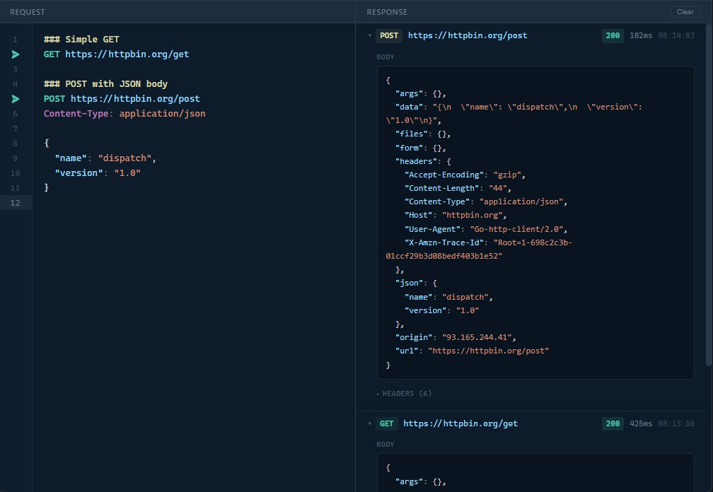

# dispatch

A lightweight desktop HTTP client for crafting and sending requests. Write `.http` file syntax in the built-in editor, hit send, and inspect responses -- all in a single native window.



## Features

- `.http` file syntax with syntax highlighting
- Support for GET, POST, PUT, PATCH, DELETE, HEAD, and OPTIONS methods
- Request headers and JSON body support
- Response viewer with status, headers, body, and timing
- Auto-save to `~/.config/dispatch/requests.http` (or equivalent config dir)
- Send with `Ctrl+Enter` or click the gutter play button

## Tech Stack

- **Backend:** Go + [Wails v2](https://wails.io)
- **Frontend:** Svelte + TypeScript + Vite

## Prerequisites

- [Go](https://go.dev/) 1.23+
- [Node.js](https://nodejs.org/)
- [Wails CLI](https://wails.io/docs/gettingstarted/installation)

## Development

```bash
wails dev
```

## Build

```bash
wails build
```

The compiled binary will be in `build/bin/`.

## Releasing

Releases are automated via GitHub Actions. Pushing a version tag triggers a build for Linux, macOS, and Windows, and publishes a GitHub Release with the binaries attached.

1. Make sure all changes are committed and pushed to `main`.

2. Create and push a version tag:
   ```bash
   git tag v1.2.3
   git push origin v1.2.3
   ```

3. The [Release workflow](.github/workflows/release.yml) will run automatically and:
   - Build `dispatch` for `linux/amd64`, `darwin/universal`, and `windows/amd64`
   - Bundle each binary into a `.zip` archive
   - Create a GitHub Release with auto-generated release notes and the archives attached

4. Monitor progress in the **Actions** tab on GitHub. Once the workflow completes the release appears under **Releases**.

> Tags must start with `v` (e.g. `v1.2.3`). Use [semantic versioning](https://semver.org/).
